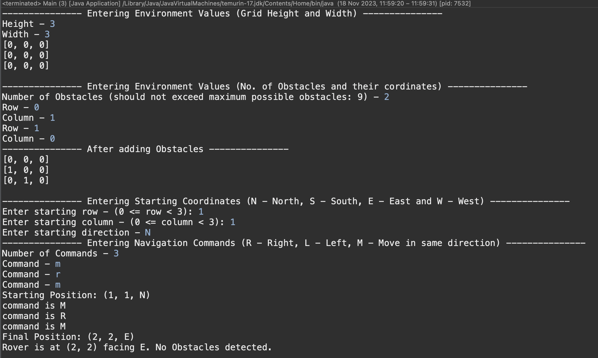

# 

## Mars - Rover Simulation

**Java Version used - OpenJDK 17.0.6**

**IDE used - Eclipse**

### To run this project

`git clone https://github.com/0710-RIshI/MarsRover.git`

**NOTE** - In case you face an issue which states that there is an issue with the Java version, you need to configure the build path to ensure that the code compiles properly using your Java version. Do note that this code has been compiled using OpenJDK-17 and is compatible with OpenJDK-17 and greater versions of Java.

**To change your build path - (shown as an example in eclipse, will change depending on your IDE)**

`Right Click on your project > Build Path > Configure Build Path > Libraries > ModulePath > Edit and change it to your compatible version of Java`

### Core concepts used

- Encapsulation
- polymorphism
- abstraction
- Exception Handling in Java
- Enums in java
- Inheritance

### Structural Design Patterns

- Composite pattern for **grid** and **obstacles**
- Command pattern for commands like **M,L,R**

## Class Definitions

### Main

- This is where the main function resides.

### Rover

- Data Members
    - x
    - y
    - ObstacleCount
    - direction
- Member Functions
    - getStatusReport()
        - prints the status of the rover with no of obstacle count
    - executeRover()
        - helps to move the rover acording to the command.

### Pair

- Defines pair in java

### Grid

- This is an interface, which defines functions that a custom grid should have

### Gridcomponent

- This is an interface used to implement Composite Design pattern with **Grid** and **Obstacles**

### MyGrid Implements Grid,Gridcomponent

- Data Members
    - a 2-D grid array
- Member functions
    - printGrid()
        - prints the grid as a 2-D matrix.
    - move()
        - helps the rover with respect to the current direction
    - isValid()
        - Checks whether the grid is valid or not.
    - fillObstacles()
        - fills the obstacles in the grid

### Obstacle implements gridcomponent

- Data Members
    - Pair
    - grid
- Member Functions
    - validObstacle()
        - checks whether the no of obstacles are valid or not
- isValid()
    - checks whether the position of obstacle is valid or not

### Command

- it encapsulates the list of commands in an object so that the commands are accessible across the main package

### Direction

- Defines N,S,E,W directions
- Member Functions
    - turnRight()
    - turnLeft()

### Instructions

It is an interface which defines the method execute() used for Command patter

### Move implements Instructions

- Data Members
    - Rover
    - grid
- Member Functions
    - execute()
        - this function executes the move operation on the rover

### Right implements Instructions

- Data Members
    - Direction
- Member Functions
    - execute()
        - executes the operation to turn the rover right

### Left implements Instructions

- Data Members
    - Direction
- Member Functions
    - execute()
        - executes the operation to turn the rover left

## Sample Test Case

